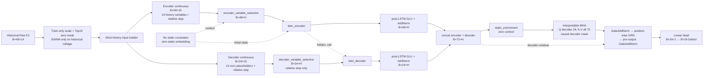

# F0 Canonical Strict-History TFT: Source-Derived Flow

```mermaid
flowchart LR
  X[Historical Raw F2\nB×48×14] --> S[Train-only scale + Top10 zero mask\nEWMA only on historical voltage]
  S --> BI[Strict-history input builder]
  BI --> EC[Encoder continuous\nB×48×15\n14 history variables + relative step]
  BI --> DC[Decoder continuous\nB×24×15\n14 zero placeholders + relative step]
  EC --> EVSN[encoder_variable_selection\nB×48×H]
  DC --> DVSN[decoder_variable_selection\nB×24×H\nrelative step only]
  Z[No static covariates\nzero static embedding] -.context.-> EVSN
  Z -.initial state.-> ELSTM[lstm_encoder]
  EVSN --> ELSTM
  ELSTM --> EG[post-LSTM GLU + AddNorm\nB×48×H]
  ELSTM -.hidden, cell.-> DLSTM[lstm_decoder]
  DVSN --> DLSTM
  DLSTM --> DG[post-LSTM GLU + AddNorm\nB×24×H]
  EG --> CAT[concat encoder + decoder\nB×72×H]
  DG --> CAT
  CAT --> SE[static_enrichment\nzero context]
  SE --> ATT[Interpretable MHA\nQ decoder 24; K,V all 72\ncausal decoder mask]
  ATT --> PN[GateAddNorm → position-wise GRN\n→ pre-output GateAddNorm]
  CAT -.decoder residual.-> PN
  PN --> OUT[Linear head\nB×24×1 → B×24 DeltaV]
```

`H=64` for future F0–F2. No future measured operating covariate reaches `DC`, `DVSN`, the LSTM decoder or attention.
