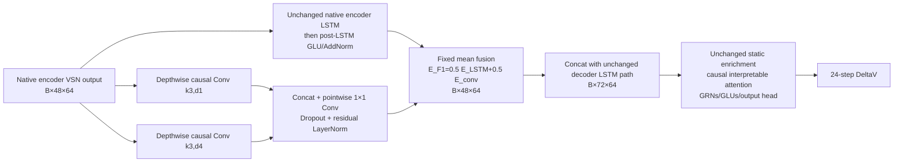

# F1: Fixed-Fusion Dual-Path Encoder

```mermaid
flowchart LR
  EVSN[Native encoder VSN output\nB×48×64] --> L[Unchanged native encoder LSTM\nthen post-LSTM GLU/AddNorm]
  EVSN --> C1[Depthwise causal Conv k3,d1]
  EVSN --> C2[Depthwise causal Conv k3,d4]
  C1 --> CP[Concat + pointwise 1×1 Conv\nDropout + residual LayerNorm]
  C2 --> CP
  L --> F[Fixed mean fusion\nE_F1=0.5 E_LSTM+0.5 E_conv\nB×48×64]
  CP --> F
  F --> CAT[Concat with unchanged decoder LSTM path\nB×72×64]
  CAT --> NATIVE[Unchanged static enrichment\ncausal interpretable attention\nGRNs/GLUs/output head]
  NATIVE --> Y[24-step DeltaV]
```

All convolutions are left-padded/causal. The decoder continues to receive the native encoder `(hidden, cell)` state, not a convolutional state.
